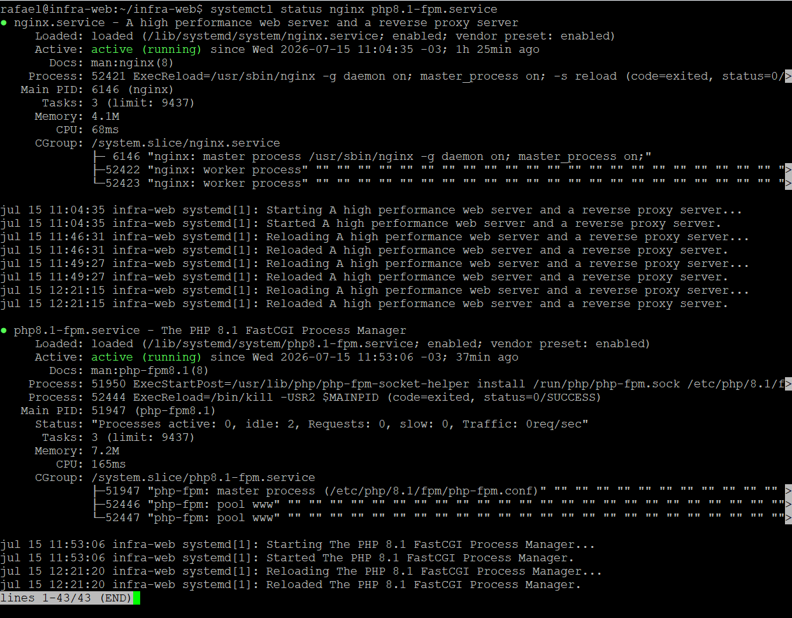
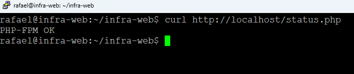
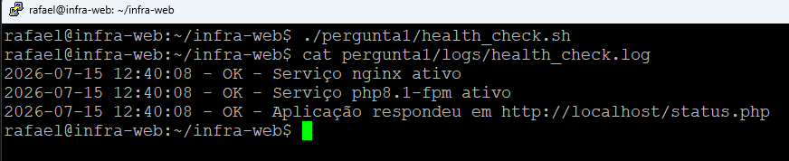
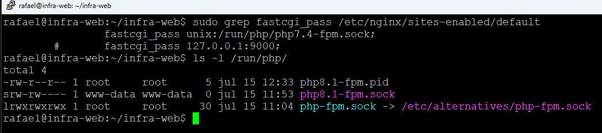
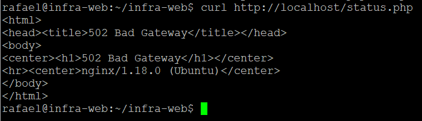
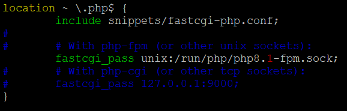
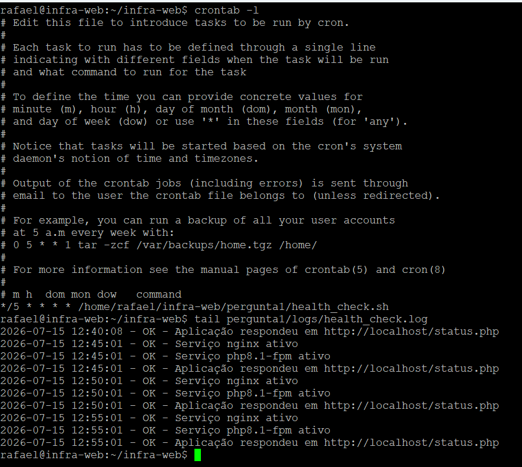

# Pergunta 1 – Linux e Resolução de Problemas

## Objetivo

Documentar uma abordagem de troubleshooting para um ambiente Nginx + PHP-FPM apresentando erro **502 Bad Gateway** e desenvolver um script para validação periódica dos serviços.

---

## Diagnóstico

Em um cenário de erro 502, a primeira etapa é verificar o estado dos serviços e coletar evidências antes de realizar qualquer alteração.

Principais comandos utilizados:

### Status dos serviços

```bash
systemctl status nginx
systemctl status php8.1-fpm
```

### Logs

```bash
journalctl -u nginx
journalctl -u php8.1-fpm

tail -f /var/log/nginx/error.log
```

### Portas e sockets

```bash
ss -lntp
ss -lx
```

### Processos

```bash
ps aux | grep nginx
ps aux | grep php-fpm
```

---

## Possíveis causas do erro 502

### 1. Serviço PHP-FPM parado

O Nginx permanece ativo, porém não consegue encaminhar as requisições para o interpretador PHP.

Validação:

```bash
systemctl status php8.1-fpm
```

---

### 2. Socket ou porta configurados incorretamente

O Nginx pode estar apontando para um socket ou porta diferente daquela utilizada pelo PHP-FPM.

Validação:

```bash
ss -lx
ss -lntp
```

Também é importante conferir a configuração do `fastcgi_pass` no virtual host do Nginx.

---

### 3. Erros na aplicação ou esgotamento do PHP-FPM

A aplicação pode estar apresentando falhas ou o PHP-FPM pode estar sem processos disponíveis para atender novas requisições.

Validação:

```bash
journalctl -u php8.1-fpm
tail -f /var/log/nginx/error.log
```

---

## Como diferenciar a origem do problema

### Servidor Web (Nginx)

- Serviço parado;
- Erro de configuração (`nginx -t`);
- Problemas no virtual host.

### Aplicação / PHP-FPM

- PHP-FPM parado;
- Socket indisponível;
- Erros na aplicação;
- Falhas registradas nos logs do PHP.

### Rede

- Porta inacessível;
- Firewall bloqueando;
- Problemas de DNS ou conectividade.

---

## Exemplo observado durante os testes

Durante a validação em laboratório foi reproduzido um cenário de erro 502 causado por incompatibilidade entre a configuração do Nginx e a versão do PHP-FPM instalada.

O arquivo de configuração continha:

```nginx
fastcgi_pass unix:/run/php/php7.4-fpm.sock;
```

Entretanto, o ambiente possuía o serviço:

```text
php8.1-fpm
```

Mesmo executando:

```bash
nginx -t
```

o retorno era:

```text
syntax is ok
test is successful
```

Isso ocorre porque o `nginx -t` valida apenas a sintaxe da configuração, não a disponibilidade do socket informado no `fastcgi_pass`.

Após alterar a configuração para:

```nginx
fastcgi_pass unix:/run/php/php8.1-fpm.sock;
```

e recarregar o Nginx, a aplicação voltou a responder normalmente.


## Health Check

Foi desenvolvido o script `health_check.sh` para validar:

- Serviço Nginx;
- Serviço PHP-FPM;
- Resposta da aplicação através de uma página PHP;
- Registro das verificações em arquivo de log.

O script retorna código de saída adequado para utilização em monitoramentos e pode ser executado periodicamente via cron por não exigir interação com o usuário.
Durante os testes, o script foi configurado para execução periódica via cron, registrando as verificações em arquivo de log, conforme demonstrado nas evidências.

---

## Evidências

### 1. Serviços ativos



---

### 2. Aplicação respondendo



---

### 3. Execução do Health Check



---

### 4. Diagnóstico inicial



---

### 5. Erro 502 causado por incompatibilidade do PHP-FPM



---

### 6. Correção da configuração



---

### 7. Execução periódica via cron




As evidências demonstram:

- Validação dos serviços Nginx e PHP-FPM;
- Funcionamento da aplicação;
- Execução do script de health check;
- Reprodução e correção de um erro 502 causado por configuração incorreta do `fastcgi_pass`;
- Execução periódica do script via cron.
