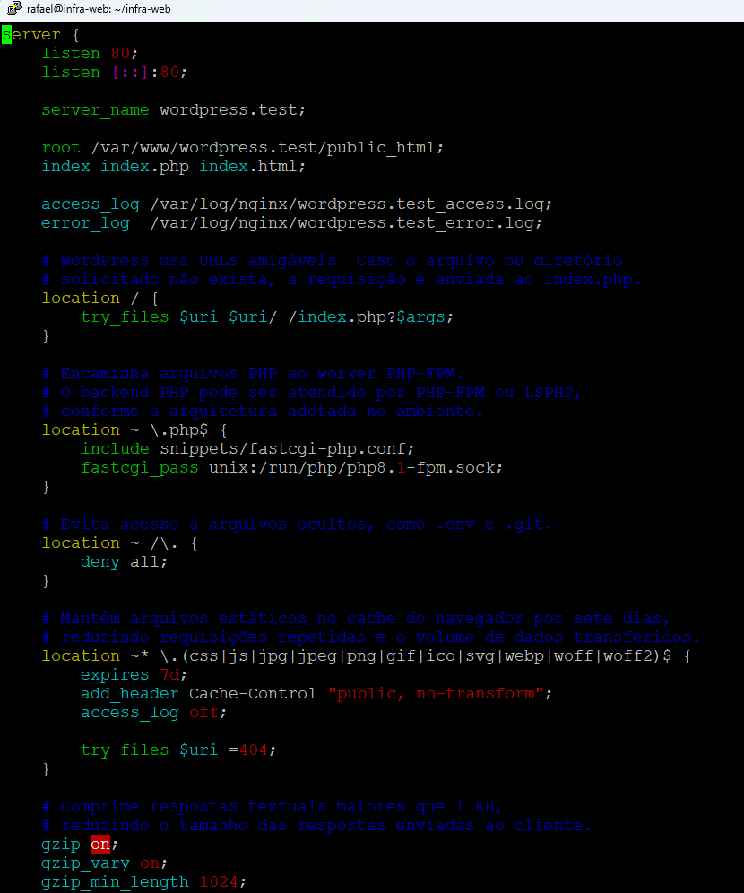
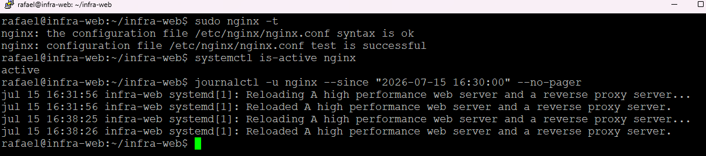
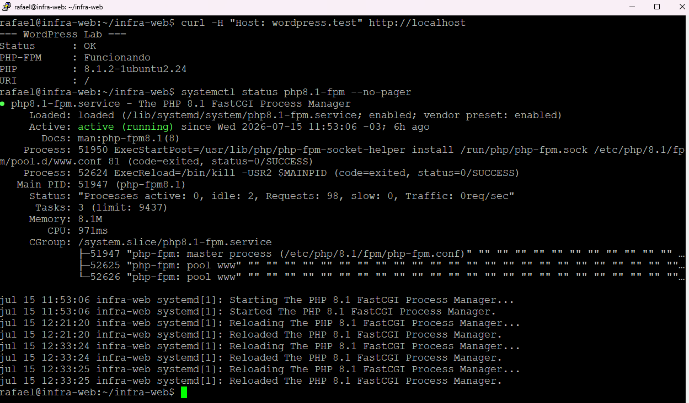
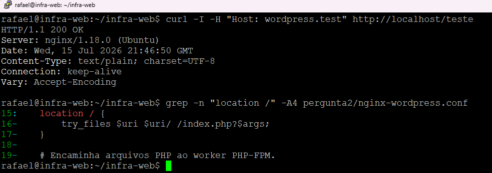
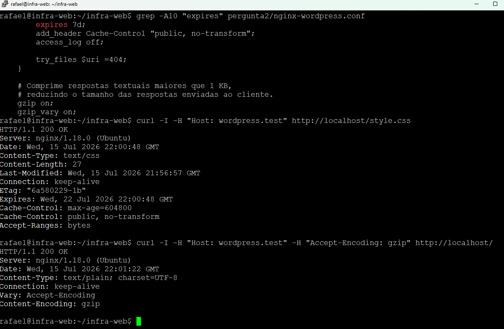

# Pergunta 2 – Nginx + LiteSpeed para WordPress

## Objetivo

Demonstrar a configuração de um virtual host Nginx para hospedagem de um site WordPress, explicando a arquitetura utilizada e implementando uma configuração com boas práticas de desempenho.

---

## Arquitetura

Na arquitetura utilizada pela Configr, o Nginx atua como servidor web na borda, recebendo as conexões dos clientes, servindo arquivos estáticos e encaminhando as requisições PHP para o worker responsável pelo processamento.

O LiteSpeed, através do LSPHP, realiza o processamento das páginas PHP da aplicação WordPress.

Fluxo simplificado:

```text
Cliente
   │
   ▼
Nginx
   │
   ├── Arquivos estáticos (CSS, JS, imagens)
   │
   └── Requisições PHP
          │
          ▼
     LiteSpeed / LSPHP
          │
          ▼
      WordPress
          │
          ▼
      MariaDB
```

No ambiente de laboratório foi utilizado o **PHP-FPM 8.1** como worker PHP para validar a configuração do virtual host, mantendo o mesmo conceito de encaminhamento das requisições PHP.

---

## LSCache

O LSCache é um mecanismo de cache de páginas que reduz a quantidade de processamento realizado pelo WordPress.

Quando uma página já foi processada anteriormente, ela pode ser entregue diretamente ao visitante sem necessidade de executar novamente PHP e consultas ao banco de dados.

Isso reduz consumo de CPU, memória e melhora o tempo de resposta da aplicação.

### Conteúdo que não deve ser cacheado

Algumas páginas possuem conteúdo específico para cada usuário e não devem utilizar cache público, por exemplo:

- `/wp-admin`
- Carrinho de compras
- Checkout
- Minha Conta
- Usuários autenticados

Nesses casos o conteúdo varia conforme a sessão do usuário.

---

## Configuração do Virtual Host

Foi desenvolvido um virtual host contendo:

- Configuração do domínio;
- Encaminhamento das requisições PHP para o worker;
- Regras de rewrite do WordPress utilizando `try_files`;
- Compressão Gzip;
- Cache para arquivos estáticos;
- Restrição de acesso a arquivos ocultos.

Cada diretiva possui comentários explicando sua finalidade no próprio arquivo de configuração.

---

## Ajustes de Performance

Foram implementadas algumas otimizações:

### try_files

Permite que URLs amigáveis do WordPress sejam encaminhadas para o `index.php` quando o arquivo solicitado não existir fisicamente.

### Gzip

Reduz o tamanho das respostas HTTP enviadas ao navegador.

### Cache para arquivos estáticos

Arquivos como imagens, CSS e JavaScript recebem tempo de expiração no navegador, reduzindo novos downloads em acessos futuros.

---

## Validação

Após a configuração foram realizados os seguintes testes:

```bash
sudo nginx -t
```

Validação da sintaxe do virtual host.

```bash
curl -H "Host: wordpress.test" http://localhost
```

Validação do encaminhamento das requisições para o worker PHP.

Também foram realizados testes das regras de rewrite do WordPress e das configurações de compressão e cache.

---

## Evidências

### 1. Virtual Host



---

### 2. Validação do Nginx



---

### 3. Worker PHP respondendo



---

### 4. Rewrite do WordPress



---

### 5. Teste de performance


