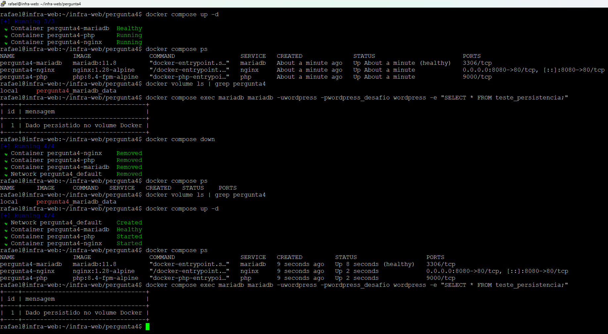

# Pergunta 4 — Containers com Docker Compose

## Objetivo

Demonstrar a utilização do Docker Compose para provisionar um ambiente composto por **Nginx**, **PHP-FPM** e **MariaDB**, utilizando persistência de dados através de volumes Docker.

---

## Vantagens da utilização de containers

A utilização de containers permite empacotar aplicações juntamente com todas as suas dependências, garantindo que o mesmo ambiente possa ser executado em diferentes servidores de forma consistente.

Entre as principais vantagens estão:

- Padronização dos ambientes de desenvolvimento, homologação e produção;
- Facilidade de implantação;
- Isolamento entre aplicações;
- Escalabilidade;
- Atualizações simplificadas;
- Redução de problemas causados por diferenças entre ambientes.

---

## O que é idempotência

O Docker Compose descreve o estado desejado da infraestrutura através do arquivo `docker-compose.yml`.

Ao executar novamente:

```bash
docker compose up -d
```

o Docker Compose compara o estado atual com o estado definido na configuração.

Caso não existam alterações, os containers existentes são reutilizados.

Caso alguma configuração tenha sido modificada, apenas os serviços necessários são recriados.

Esse comportamento torna a implantação previsível, repetível e segura.

---

## Arquitetura implementada

Foi implementado o seguinte ambiente:

```text
Cliente
    │
    ▼
Nginx
    │
    ▼
PHP-FPM
    │
    ▼
MariaDB
```

Foram utilizadas as seguintes imagens oficiais:

| Serviço | Imagem |
|---------|--------|
| Nginx | nginx:1.28-alpine |
| PHP | php:8.4-fpm-alpine |
| Banco | mariadb:11.8 |

O acesso HTTP foi publicado na porta **8080** do host para evitar conflito com o Nginx instalado diretamente na máquina virtual.

---

## Estrutura do projeto

```text
pergunta4/
├── docker-compose.yml
├── README.md
├── nginx/
│   └── default.conf
├── php/
│   └── index.php
└── evidencias/
```

---

## Persistência de dados

O MariaDB utiliza um volume Docker nomeado:

```yaml
volumes:
  mariadb_data:
```

Esse volume mantém os dados do banco mesmo após a remoção dos containers utilizando:

```bash
docker compose down
```

Os dados somente são removidos quando o volume também é excluído, por exemplo utilizando:

```bash
docker compose down -v
```

---

## Validação

Após a criação do ambiente foram executados os seguintes testes.

### Validação da configuração

```bash
docker compose config
```

Verifica a sintaxe do arquivo `docker-compose.yml`.

---

### Inicialização do ambiente

```bash
docker compose up -d
```

Cria automaticamente:

- rede Docker;
- volume persistente;
- container Nginx;
- container PHP-FPM;
- container MariaDB.

---

### Verificação dos containers

```bash
docker compose ps
```

Resultado esperado:

- MariaDB em estado **healthy**;
- PHP-FPM em execução;
- Nginx em execução.

---

### Validação da aplicação

```bash
curl -I http://localhost:8080
```

Resultado:

```text
HTTP/1.1 200 OK
```

Também foi validado o processamento do PHP através da página `phpinfo()`:

```bash
curl http://localhost:8080
```

---

## Teste de persistência

Para validar a persistência do banco de dados foi criada uma tabela de teste.

Exemplo:

```sql
CREATE TABLE teste_persistencia (
    id INT AUTO_INCREMENT PRIMARY KEY,
    mensagem VARCHAR(100)
);

INSERT INTO teste_persistencia (mensagem)
VALUES ('Dado persistido no volume Docker');
```

Posteriormente foi executado:

```bash
docker compose down
```

removendo os containers.

Em seguida o ambiente foi recriado:

```bash
docker compose up -d
```

Por fim foi executada novamente a consulta:

```sql
SELECT * FROM teste_persistencia;
```

O registro permaneceu disponível, demonstrando que o volume Docker preservou os dados do MariaDB mesmo após a remoção dos containers.

---

## Evidências

Durante a implementação foram realizados os seguintes testes:

- validação do arquivo `docker-compose.yml`;
- criação do ambiente com `docker compose up -d`;
- verificação dos containers em execução;
- confirmação do estado **healthy** do MariaDB;
- criação de uma tabela de teste;
- inserção de dados no banco;
- remoção dos containers utilizando `docker compose down`;
- verificação da permanência do volume Docker;
- recriação do ambiente;
- confirmação de que os dados permaneceram armazenados no volume persistente.

A figura abaixo apresenta todo o fluxo de validação realizado durante os testes em laboratório.



---

## Conclusão

O ambiente solicitado foi implementado utilizando Docker Compose com sucesso.

Foram validados:

- criação automatizada dos serviços;
- comunicação entre Nginx, PHP-FPM e MariaDB;
- processamento de páginas PHP;
- utilização de volume persistente para o banco de dados;
- comportamento idempotente do Docker Compose;
- preservação dos dados após a recriação dos containers.
