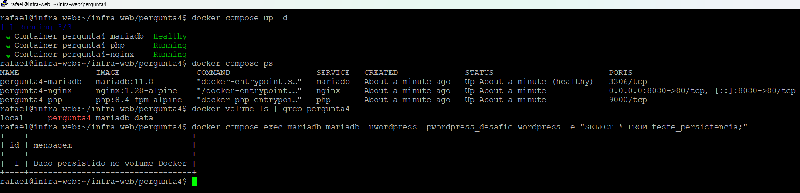

# Módulo Puppet — hosting

## Objetivo

O módulo `hosting` implementa o provisionamento automatizado de clientes para um ambiente de hospedagem compartilhada.

Foi desenvolvido de forma modular, parametrizada e idempotente, permitindo reutilização para múltiplos clientes.

---

# Estrutura

```
hosting/
├── examples/
├── manifests/
├── templates/
├── files/
├── metadata.json
└── README.md
```

---

# Arquitetura

O módulo foi dividido em responsabilidades independentes.

| Manifest | Responsabilidade |
|----------|------------------|
| stack.pp | Instala e configura a stack compartilhada |
| user.pp | Cria usuário, grupo e estrutura de diretórios |
| wordpress.pp | Instala WordPress, gera wp-config.php e instala LSCache |
| vhost.pp | Gera Virtual Hosts do Nginx e LiteSpeed |
| client.pp | Orquestra todo o provisionamento do cliente |

---

# Fluxo de provisionamento

A ordem lógica utilizada é:

```
hosting::stack

↓

hosting::user

↓

hosting::wordpress

↓

hosting::vhost
```

Cada recurso possui dependências explícitas para garantir um catálogo consistente.

---

# Templates

O módulo utiliza templates EPP para geração dos arquivos de configuração.

### nginx-vhost.conf.epp

Gera o Virtual Host do Nginx responsável pela camada de borda.

### litespeed-vhost.conf.epp

Modelo de Virtual Host do LiteSpeed.

### wp-config.php.epp

Gera automaticamente o arquivo de configuração do WordPress contendo:

- banco de dados;
- usuário;
- senha;
- host;
- habilitação do cache (`WP_CACHE`).

---

# Exemplo de utilização

```puppet
class { 'hosting::stack':
  manage_litespeed => false,
}

hosting::client { 'cliente1':
  domain            => 'cliente1.test'
  system_user       => 'cliente1'
  backend_port      => 8101
  db_name           => 'cliente1_wp'
  db_user           => 'cliente1_wp'
  db_password       => 'senha'
  manage_litespeed  => false
}
```

O diretório `examples/` contém um exemplo completo de provisionamento.

---

# Idempotência

Todos os recursos foram desenvolvidos considerando reexecuções sucessivas.

Após o ambiente já estar provisionado, uma nova execução do catálogo não gera alterações desnecessárias.

Downloads, extrações, criação de diretórios, geração de arquivos e demais recursos utilizam mecanismos declarativos (`creates`, `unless`, `require`, `subscribe`, etc.) para preservar a idempotência.

---

# Evidências

Durante o laboratório foram realizadas as seguintes validações:

- provisionamento de novos clientes;
- reaplicação do catálogo;
- criação da estrutura isolada;
- geração dos Virtual Hosts;
- validação do Nginx;
- instalação do WordPress;
- instalação do LSCache.

```



```

---

# Melhorias para ambiente de produção

Em um ambiente real de hospedagem seriam adicionados recursos como:

- OpenLiteSpeed/LiteSpeed Enterprise totalmente configurado;
- criação automática do banco de dados e usuário;
- instalação completa do WordPress utilizando WP-CLI;
- emissão automática de certificados Let's Encrypt;
- integração com DNS;
- isolamento adicional entre clientes (ACLs, PHP pools, namespaces ou containers);
- monitoramento;
- backups automatizados;
- integração com CI/CD;
- gerenciamento de segredos (Vault ou equivalente).

---

# Considerações

O foco desta implementação foi demonstrar a estrutura do módulo Puppet, separação de responsabilidades, parametrização, reutilização e idempotência, conforme solicitado no desafio técnico.
